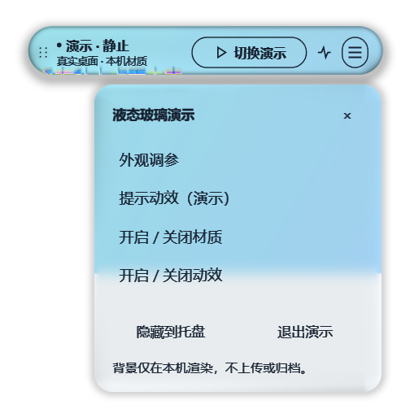
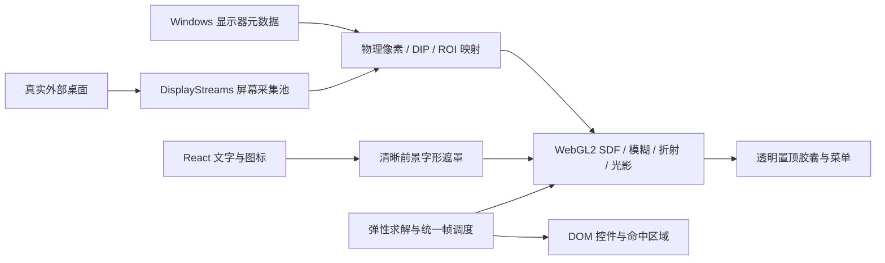

# Electron Liquid Glass

从 LearningWithYou 正式集成版提取的 **Windows / Electron / WebGL2 液态玻璃演示与接入参考**。在真实外部桌面背景上绘制固定胶囊和圆角菜单，保留原材质、弹性动效、清晰文字、拖动及手动调参。

适用于已有 Electron 桌面工具的悬浮工具条原型与图形工程参考。没有学习会话、录音、麦克风、ASR、模型请求、API 配置或学习历史；无需 Next.js、原项目或另一个 App。它不是任意形状/框架的通用组件库。



图片来自本工程在 Windows 上实际运行的 WebGL2 输出，背景由**另一个独立进程的生成测试文档**提供，经真实桌面采集进入材质；不是静态贴图替代采集。只截取胶囊/菜单，未收录私人桌面或上游演示素材。验证步骤及限制见 [验证记录](docs/VALIDATION.md)。

## 参考与致谢

**参考项目：Liquid Glass Studio，作者 Charles Yin（iyinchao）。**

- 演示地址：[https://liquid-glass.iyinchao.cn/](https://liquid-glass.iyinchao.cn/)
- 源码地址：[iyinchao/liquid-glass-studio](https://github.com/iyinchao/liquid-glass-studio)
- 核对提交：[`f7b28c36305a862f5cffed3ddd51511cf1204f56`](https://github.com/iyinchao/liquid-glass-studio/tree/f7b28c36305a862f5cffed3ddd51511cf1204f56)

光学 shader 包含上游代码的直接改编，**并非全部原创，也不只是设计灵感**。完整 MIT 版权和许可保留在 [upstream/LICENSE.txt](src/glass/upstream/LICENSE.txt)，Copyright (c) 2024 Charles Yin。请一并阅读 [第三方声明](THIRD_PARTY_NOTICES.md)、[正式来源记录](src/glass/UPSTREAM.md)、[提取说明](docs/provenance/EXTRACTION.md) 和 [本仓库许可范围](LICENSE.md)。原创部分未发现明确开源许可，不能把上游 MIT 扩张为全仓库授权。

这是参考 Liquid Glass 风格的 Electron 实现；不是 Apple 官方实现、原生 Liquid Glass API、上游官方 Electron 版本，也没有相关背书。

## 环境与快速开始

当前运行适配仅支持 **Windows x64**。本次验证：Windows 11 build 22621、Node.js 24.18.0（安装/构建）、npm 11.16.0、Electron **44.3.0** / Chromium 152、NVIDIA RTX 2060 / ANGLE D3D11、1920×1080 单屏 / 140% 缩放。未实测 macOS、Linux、ARM64、多屏实机或 HDR。没有 WebGPU 后端。

需要 Git、Node.js 24.x / npm 11，以及 Windows 自带 .NET Framework 4.x C# 编译器：`%WINDIR%\Microsoft.NET\Framework64\v4.0.30319\csc.exe`。构建会从源码编译只读显示器元数据工具，无需 Visual Studio 或 .NET SDK。Electron 二进制首次使用可能从其官方分发源下载；网络受限时应按 Electron 官方说明配置下载代理。

```powershell
git clone https://github.com/xianzhou127/Electron-Liquid-Glass.git
cd Electron-Liquid-Glass
npm ci
npm run check
npm run test:gpu
npm run test:desktop
npm start
```

仓库为 Private，克隆需要已获仓库访问权限的 GitHub 账号；本地演示运行无需账号。`npm run check` 顺序执行类型检查、lint、单元测试和生产构建。`npm run build` 生成 `dist/`；`npm start` 运行已有生产输出，`npm run dev` 先构建再启动，`npm start -- --tuner` 同时打开调参窗口。无开发服务器、外部账户或服务配置。不要只拷贝某个 JS 文件；生产目录还需要 renderer、native 和许可证资源，以及匹配 Electron 运行时。

`test:gpu` 使用合成输入验证 GPU 数值与生命周期，不采集桌面；`test:desktop` **会打开真实桌面采集**，同时打开单独的生成文档窗口，使用独立临时 userData 并自动退出。原始测试结果及本机测试配置写在已忽略的 `artifacts/`，不要上传整个目录。

本仓库不发布 npm 包或公网服务；二进制输出不进入源码 Git。当前不提供已签名安装包。

## 演示操作

- 启动后胶囊出现在主屏上方，按默认预设开启材质。左侧点阵拖柄可拖动，聚焦拖柄后方向键微调。锚点松手立即提交，弹性回弹不移动真实位置。
- “切换演示”轮换静止/活跃/过渡/提示四个**纯视觉状态**；脉冲按钮触发一次提示动效，没有后台任务。
- “更多”打开同一宿主内的玻璃菜单。菜单跟随胶囊、复用采集与 GPU 缓存，默认固定高磨砂。点击按钮不强制关闭；转移到其他窗口导致真实失焦时收起，也可再次点击更多、关闭按钮或 Esc。
- 右键胶囊 → 外观调参，或点击状态下方文字/菜单中的外观调参。关闭调参窗口，胶囊继续运行。
- 菜单和调参窗口均有材质/动效开关；A 为无材质、B 为基础模糊、C 为完整材质。A 或关闭材质时无背景采集。减少动态效果与系统偏好均受尊重。
- “隐藏到托盘”释放材质采集与 GPU 资源。托盘 → 显示胶囊可恢复；双击托盘也可恢复。调参窗口有独立显示、隐藏与退出入口。Esc 在菜单打开时收起菜单，否则隐藏胶囊。
- 采集失败或 WebGL 上下文丢失时清除旧画面，显示可操作的普通胶囊及原因。在调参窗口重新开启材质可以重试。

## 调参、预设与保存

默认不是工程 `DEFAULT_*`，而是正式集成沿用的静态 **candidate24** 和最终动效 **candidate10**；预设 JSON 经核对仅含数值/开关与历史版本时间，不含个人配置、路径或密钥。菜单高磨砂来自正式 T15 的默认行为。

| 类型 | 可调内容 | 持久化行为 |
| --- | --- | --- |
| 材质 | 折射、IOR、色散、模糊、菲涅尔、阴影、光源、轮廓、前景、自适应磨砂、菜单高磨砂；30/60 fps 目标 | 点击“保存材质参数”保存，含下次启动自动开启偏好 |
| 动效 | 强度、时长、鼓胀、拉伸、接触光、传播距离/宽度/时长、阻尼、阶段、总开关、减少动态效果 | 点击“保存动效参数”单独保存 |
| 当前预览 | 滑块、输入框、导入 JSON、恢复验收预设 | 立即生效，未保存时重启丢弃 |
| 恢复已保存值 | 放弃本轮预览，回到本次启动加载或最近成功保存的值 | 不写磁盘；从未保存时回到内置预设 |

面板明确显示预览是否未保存、启动来源和保存时间。恢复验收预设仅预览，仍需保存；“恢复已保存值”和“恢复默认”不是同一个动作。导入 JSON 是用户主动选文件的只读操作，不自动查找原项目参数。高光/折射诊断视图不是桌面验收视图，保存时恢复正常显示。

受力预览按钮可保持拖柄或中心受力，边调参边观察，再点“松手”或“预览转向一次”。所有数值范围、单位及说明在面板显示，完整表见 [参数文档](docs/PARAMETERS.md)。

## 实现架构



三层目录：`src/glass/` 的光学/动效核心；`src/main.ts`、`preload.ts`、`glass/host.ts`、`sources.ts` 和原生工具构成 Electron 适配；`demo-*`、`visual-state.ts` 和调参组件构成独立演示。详细模块入口、输入和释放顺序见 [接入文档](docs/INTEGRATION.md)。

CSS `backdrop-filter` 适合过滤**同一网页合成层**后面的内容，不能据此获得另一个原生窗口的桌面像素。本项目由 Electron 采集真实桌面视频，再映射到胶囊 ROI，通过 WebGL2 绘制；同时承担采集权限、映射、纹理上传、生命周期和 GPU 成本。普通降级样式并不等价于液态玻璃效果。

## 采集、数据与资源

应用身份和数据目录独立：`%APPDATA%\Electron-Liquid-Glass\appearance-v1\`，包含 `material-v1.json`、`motion-v1.json`、`display-adaptation-v1.json` 与必要旧配置备份。不读取 LearningWithYou 用户数据。开发测试可以通过 `LIQUID_GLASS_USER_DATA` 指定专用空目录，不要指向其他应用目录。

材质可见且启用时预热**全部已连接显示器**的视频流，并按缩放比例准备有限渲染缓存；跨屏时直接复用。采集仅请求视频，不请求音频/摄像头。原生工具只枚举显示器，不再枚举应用窗口标题。背景帧只用于本机 GPU 渲染，不上传、不归档；显示器缓存只含布局、尺寸和色彩等数值元数据。正式运行禁用 HTTP(S)/WebSocket 请求，CSP 不允许连接外网。

胶囊/菜单宿主始终 `setContentProtection(true)`，包括关闭材质时；授权还检查可信主框架、应用 origin、可见性、显示器白名单、单次来源及 generation。调参窗口也启用截图排除。此行为用于避免递归取样，**不是绝对防截屏能力**，效果依赖 Windows、驱动和采集方式；应用内部 QA 的 `capturePage` 仍能取得本应用渲染结果。参考 [Electron 文档](https://www.electronjs.org/docs/latest/api/browser-window#winsetcontentprotectionenable-macos-windows)。

菜单收起保留有限预热缓存并停止绘制；关闭材质、隐藏、来源结束/停帧、上下文丢失和退出释放视频轨道、回调与 WebGL 资源。显示拓扑变化使旧授权失效并重新准备。设置文件采用校验、临时写入/原子替换和备份，损坏原件不被静默删除。

## 限制与性能

- 固定 **321×52 DIP** 分配尺寸、309×40 DIP 胶囊、20 DIP 半径；六个前景分组、固定按钮布局。菜单宽 252 DIP、16 DIP 圆角，内容高度受工作区约束，菜单没有胶囊级整体弹性拖拽。
- 若改形状/布局，需同步修改 SDF、遮罩、命中、采样 padding、菜单映射与测试；不能只改 CSS。保留的 `.learning-*` 类名是历史固定前景选择器，不是业务依赖。
- 全屏透明宿主跨显示器联合矩形，透明区通过命中判断穿透；阴影不构成点击区域。多屏算法、负坐标和混合 DPI 有数值/GPU 回归，本次只有单屏实机。
- 预热所有屏幕增加视频解码、GPU 纹理和上下文驻留，首帧存在采集/编译延迟。30/60 是采集请求目标，实际帧率受桌面活动与驱动影响，绘制与采集频率不同。短时通过不等于长期无泄漏保证。
- 未验证：实机跨屏、HDR、不同显卡、触摸、热插拔、休眠唤醒、远程桌面、长期资源稳定性和正式安装包。没有逐帧桌面图像日志或云诊断。

开发规范见 [CONTRIBUTING.md](CONTRIBUTING.md)。本仓库保留独立新 Git 历史与来源指纹；自动检查通过不代替所有者最终视觉验收。
